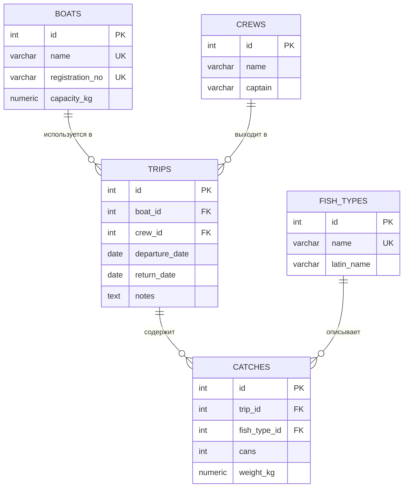

# Схема данных

Схема соответствует реляционной модели PostgreSQL из `sql/001_schema.sql`.

## Связи

- Один катер выполняет много рейсов (`boats.id → trips.boat_id`).
- Одна команда участвует во многих рейсах (`crews.id → trips.crew_id`).
- Один рейс содержит много записей улова (`trips.id → catches.trip_id`).
- Один сорт рыбы встречается во многих записях улова (`fish_types.id → catches.fish_type_id`).

## Ограничение предметной области

При добавлении улова API суммирует уже записанный вес по рейсу и отклоняет операцию с HTTP `422`, если новый суммарный вес превышает `boats.capacity_kg`.
